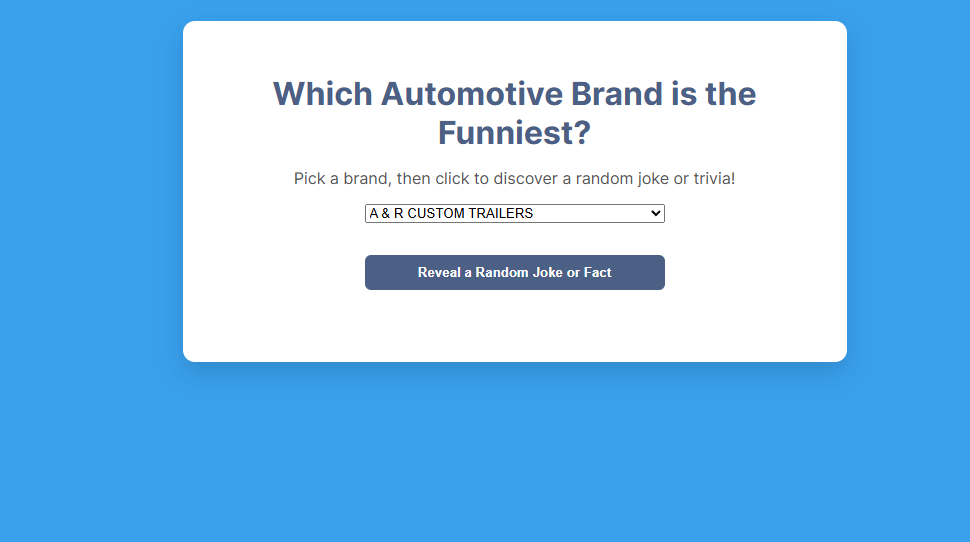

# Which Automotive Brand is the Funniest?

This is a simple and fun web app that lets you choose a car brand and then shows you a random joke or trivia fact. The app is built using Vite, JavaScript, HTML, and CSS. It uses free APIs to get random facts and jokes. All jokes and facts appear in a popup modal with buttons that let users react to what they read.

---

## Live Demo

You can view the project here:  
[https://automotive-jokes-tkh.netlify.app/](https://automotive-jokes-tkh.netlify.app/)

---

## Disclaimer

Sometimes the app might not load a fact or joke right away, especially the first few times you run it. This can happen because of how the APIs respond. If this happens, be patient and try clicking the button again or choosing a different brand from the dropdown. The app uses a backup joke list if needed.

---

## How to Run the Project

Follow these steps to run the app on your computer:

1. Clone the repository from GitHub:
git clone https://github.com/alxm101/RakeenAlam_TKHIF_PH1_FINAL_PROJECT.git

2. Install the required packages:
npm install

3. Start the development server:
npm run dev

4. Open your browser and go to:
http://localhost:5173

---

## APIs Used in This Project

1. **JokeAPI**  
This gives a random joke in plain text. The app uses the safe-mode version.  
Link: https://jokeapi.dev/

2. **NHTSA Vehicle API**  
This is used to load a full list of car makes (brands) for the dropdown.  
Link: https://vpic.nhtsa.dot.gov/api/

If the JokeAPI fails or returns nothing, the app uses a backup list of jokes.

---

## Features of the App

- Dropdown list of car brands pulled from a live API
- Button to show a random joke or trivia fact
- Facts and jokes appear inside a popup
- Two vote buttons to react to what is shown
- Message appears after voting
- The design uses a custom color palette and Google Fonts
- Fully responsive and works on desktop and mobile

----------

## Design Details

- Main background color: `#39A0ED`
- Secondary button/header color: `#4C6085`
- Highlight and accent color: `#13C4A3`
- Hover highlight color: `#FFD166`
- The modal uses a handwriting-style font for a fun effect

----------

## Screenshot

Here’s what the app looks like when it runs:

----------
## Folder Structure

src/
api/
factService.js - handles API calls and fallback logic
ui/
events.js - sets up dropdown, modal, and vote buttons
renderFacts.js - optional: used for rendering fact cards
styles/
style.css - all the custom styles and animations
main.js - entry point, connects everything
index.html - main HTML layout with modal structure

---

## Author

This project was created by Rakeen Alam for the The Knowledge House. IT IS STILL IN BETA AND THERE ARE CHANGES TO COME SOON.

